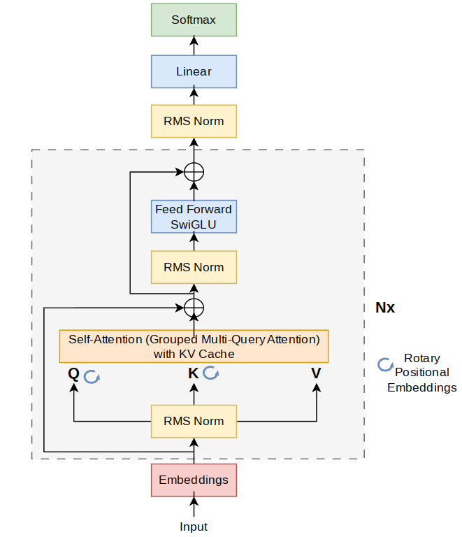

# Requirements
* linux (might run on mac aswell)
* python3
* pip
* a c compiler (tested on gcc and clang)
#### optional:
* cuda(nvcc) for GPU support

# Usage guide:
1. run pip install -r requirements.txt
2. download the meta llama2 7B [weights](https://llama.meta.com/llama-downloads), we **highly recommend to download the llama2-7b-chat** model since the output of this model is way better than the base model, even just for text generation
3. After downloading the model create a /bin directory in the project root and move the llama-2-7b-chat directory and the tokenizer.model file into the /bin dir
4. Export the model weights into a our binary file format by running export.py (use --h for a usage guide)
5. Compile the c/cuda library which is used for quantization and model inference by running the following commands:
```
mkdir build && cd build
cmake .. -DCUDA=ON # with cuda runtime
cmake .. # without cuda
make
```
6. You can now run text completion using the base model using the follwing command:
```
python3 run.py --bin=bin/chat-llama.bin "Richard Feynman was a "
```
* This works but is very slow, so we suggest you to quantize the model weights by running quantize.py (--h for usage info) we have a forward pass implemented for 8bit and 4bit quantization
* note that for GPUs we did only implement a 4bit forward pass since we would not be able to test any larger weight file due to hardware constraints. Nevertheless this has the advantage that this runs on almost any GPU since this only require around 6GB of VRAM
* consider adjusting the parameters of the text generation like type: top_p, top_k, greedy and temperature to improve inference quality
* to do prompt engineering to the model, have a look at the file chat.py
* to learn more about llama2 consider taking a look at our model.py file which contains a very easy to understand pytorch implementation from scratch. However, we also implemented and use our cuda/c version, which can be found in /lib.
# LLama2 model information


#### Input
* tok_embeddings (vocab_size, embedding_dim) = (32000,4096)
### Layer 0-31
#### Attention
* attention_norm (embedding_dim) = (4096)
* attention.wq (embedding_dim, embedding_dim) = (4096, 4096)
* attention.wk (embedding_dim, embedding_dim) = (4096, 4096)
* attention.wv (embedding_dim, embedding_dim) = (4096, 4096)
* attention.w0 (embedding_dim, embedding_dim) = (4096, 4096)
#### FeedFordward
* feed_forward.norm (embedding_dim) = (4096)
* feed_forward.w1 (embedding_dim, hidden_dim) = (4096, 11008)
* feed_forward.w3 (embedding_dim, hidden_dim) = (4096, 11008)

(w1 and w3 get both applied to the input embeddings and then element wise multiplied)
* feed_forward.w2 (hidden_dim, embedding_dim) = (11008, 4096)


### Outputs
* norm (embedding_dim) = (4096)
* output (embedding_dim, vocab_size) = (4096, 32000)



# References:

* https://github.com/karpathy/llama2.c
* https://youtu.be/kCc8FmEb1nY
* https://youtu.be/oM4VmoabDAI
